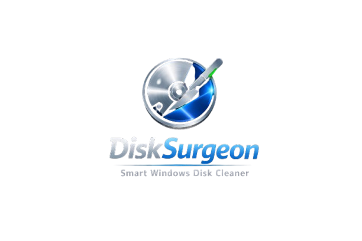

<div align="center">



# 💉 DiskSurgeon

### Smart Windows Disk Cleaner — Free up 20–90 GB safely, without breaking anything.

[](https://github.com/hvcrealm/DiskSurgeon/releases/latest)
[](https://github.com/hvcrealm/DiskSurgeon/releases/latest)
[](https://github.com/hvcrealm/DiskSurgeon/releases/latest)
[](https://github.com/hvcrealm)

**[⬇️ Download for Windows](https://github.com/hvcrealm/DiskSurgeon/releases/latest)** &nbsp;•&nbsp;
**[📋 Changelog](https://github.com/hvcrealm/DiskSurgeon/releases)** &nbsp;•&nbsp;
**[🐛 Report a Bug](https://github.com/hvcrealm/DiskSurgeon/issues)**

</div>

---

## What is DiskSurgeon?

DiskSurgeon is a **professional Windows disk cleaner** that goes far beyond the built-in Disk Cleanup. It finds junk you didn't know existed, tells you exactly what each item is, who made it, and whether it's safe to delete — then lets you clean it in one click.

No bloat. No subscriptions. No registry tricks. Just honest, safe disk recovery.

> **Typical result: 10–35 GB freed in under 5 minutes.**

---

## ✨ Features

### 🗑️ Tab 1 — Junk Cleaner
Scans 30+ known Windows junk locations instantly.

| Category | What it finds |
|---|---|
| 🪟 Windows System | Temp files, Prefetch, Crash Dumps, Windows.old (up to 30 GB) |
| 🔄 Windows Update | SoftwareDistribution cache, Delivery Optimization |
| 🌐 Browser Cache | Chrome, Edge, Firefox, Brave, Opera |
| 💻 Developer Cache | npm, yarn, pip, conda, NuGet, Cargo, Go, VS Code, JetBrains |
| 📄 Microsoft Apps | Teams cache (1–5 GB!), Office temp, OneDrive logs |
| 🎮 Gaming | Steam redist packages, depot cache, Epic Games logs |

---

### 🔬 Tab 2 — Deep Scanner
Walks your **entire C:\\ drive** to find forgotten project folders that silently eat your disk.

- `node_modules` — every JS project, 100 MB–2 GB each, 100% regeneratable
- `.venv` / `venv` — Python virtual environments per project
- `__pycache__` — Python bytecode across all projects (aggregated)
- `.next`, `.nuxt`, `.svelte-kit`, `.angular` — JS framework build outputs
- `dist/`, `build/`, `target/` — compiled artifacts from every project
- `.gradle`, `.turbo`, `.parcel-cache`, `.webpack` — tool caches
- `__MACOSX` junk, `coverage/` reports, `.tox` environments

---

### 📦 Tab 3 — App Analyzer
Reads your installed programs and **flags bloatware** with explanations.

- 🛡️ OEM antivirus (McAfee, Norton, Avast) — Windows Defender is free and better
- 🎮 Pre-installed games (Candy Crush, Solitaire, 3D Viewer)
- 📦 Abandoned Microsoft apps (Groove Music, Movies & TV, Maps)
- ⚡ Heavy Electron apps where web versions exist (Skype, Teams old, Discord)
- 🍎 Apple helper services (Bonjour, QuickTime) — security risks on Windows
- 🔧 OEM tools (HP Support, Dell SupportAssist, Acer Care)

Each flagged app shows: **publisher, install date, install size, and exactly why it's flagged** — so you make the call, not us.

---

## 🔄 Automatic Updates

DiskSurgeon checks for updates automatically on launch via the GitHub Releases API.

- **Soft update** — a dismissable banner appears when a newer version is available
- **Hard update (forced)** — if a release sets a `minimum_version`, builds older than that are **blocked** from running until updated. This is used only for critical bug fixes or security patches.
- **Manual check** — available in the About dialog → "Check for Updates"

The update check is non-blocking and silent when you're up to date.

---

<div align="center">

| Junk Cleaner | Deep Scanner | App Analyzer |
|---|---|---|
|  |  |  |

</div>

---

## ⬇️ Download & Install

**No installation required.** DiskSurgeon is a single portable `.exe`.

1. Go to **[Releases](https://github.com/hvcrealm/DiskSurgeon/releases/latest)**
2. Download `DiskSurgeon.exe`
3. Right-click → **Run as Administrator** *(for full access to system folders)*
4. Click **Scan Now**

> **Requirements:** Windows 10 or 11 (64-bit) · No Python needed · No install needed

---

## 🔒 Safety Guarantees

DiskSurgeon is built around one rule: **never break your PC.**

- ✅ Every item has a **SAFE / MODERATE / DO NOT DELETE** rating
- ✅ Dangerous items like `pagefile.sys` and `C:\Windows\Installer` are **locked** — checkbox is disabled, shown for information only
- ✅ Moderate-risk items show a **confirmation warning** with full explanation before deletion
- ✅ Nothing is deleted until you explicitly tick the checkbox AND confirm
- ✅ Deep scan skips `Windows\`, `Program Files\`, `$Recycle.Bin`, and all protected system dirs

---

## 🔐 Privacy

DiskSurgeon collects **anonymous, aggregated usage statistics** to help improve the tool. This is what gets sent:

| Collected | Example | Why |
|---|---|---|
| OS version & edition | `Windows 11 Pro / 22631` | Track compatibility |
| Architecture | `AMD64` | 32/64-bit support decisions |
| RAM bucket | `16 GB` (rounded) | Performance tuning |
| Disk size | `500 GB total / 120 GB free` (±10 GB) | Feature prioritization |
| Screen resolution | `1920×1080` | UI layout decisions |
| Locale & timezone | `en_IN / IST` | Regional support |
| Admin status | `true/false` | Feature availability |
| Scan module used | `junk_cleaner` | Usage analytics |
| Space freed | `4.2 GB` | Impact tracking |

**Never collected:** usernames, hostnames, file names, folder paths, scan results, or any personally identifiable information. Device ID is a SHA-256 hash of your Windows MachineGuid — non-reversible and non-identifiable.

Analytics powered by [Gorq Infrastructure](https://gorqai.digital) (EU servers, GDPR-compliant).

---

## ❓ FAQ

**Q: Do I need Python installed?**
No. DiskSurgeon ships as a standalone `.exe`. Python is bundled inside.

**Q: Why does it need Administrator?**
Some junk folders (Windows Temp, SoftwareDistribution, Prefetch) require elevated access. Without admin, those folders are skipped — the rest still works.

**Q: Will it delete my files/documents?**
Never. DiskSurgeon only targets known cache, temp, and build artifact locations. Your Documents, Downloads, Desktop, and all personal files are completely untouched.

**Q: Is it safe to delete node_modules?**
Yes. Run `npm install` in the project folder to restore them in seconds. DiskSurgeon shows you the exact project path so you know what you're deleting.

**Q: What about Windows.old?**
Windows.old lets you roll back to a previous Windows version. DiskSurgeon marks it as **Safe** to delete only because: if your PC has been stable for weeks post-upgrade, you don't need it. It's your call.

**Q: Is the source code available?**
Not yet. DiskSurgeon is free to use but currently closed-source. Source will be released in the future.

---

## 🆕 Changelog

### V1.0.0 — Initial Release
- 3-tab interface: Junk Cleaner, Deep Scanner, App Analyzer
- 30+ known junk target locations
- Recursive deep scan for node_modules, Python venvs, build artifacts
- 50+ bloatware signatures in App Analyzer
- McAfee-inspired professional dark UI (no-install portable exe)
- Anonymous analytics via Aptabase
- Self-save: offers to copy to Desktop if run from Downloads/Temp
- Admin detection with visual badge
- About dialog with developer info and privacy disclosure

---

## 👨‍💻 Author

<div align="center">

**Dr. Harsh Vardhan Chopra**
`@hvcrealm`

[](https://github.com/hvcrealm)

*Built with Python + <3 · Designed for real-world disk recovery*

</div>

---

## ❤️ Support the Project

DiskSurgeon is **completely free**. If it saved your disk space and sanity, please consider supporting development:

<div align="center">

### Crypto Donation (ETH / ERC-20)

```
0x750e1FfE541B91c4Dbfec70eD27531775F9c6b5C
```

*Accepts ETH, USDT, USDC, and any ERC-20 token on Ethereum mainnet, preferred Binance or Polygon chain usdt or pol.*

---

### Other ways to support

| Action | Why it helps |
|---|---|
| ⭐ **Star this repo** | Helps others find DiskSurgeon on GitHub |
| 🐛 **Report bugs** via [Issues](https://github.com/hvcrealm/DiskSurgeon/issues) | Makes it better for everyone |
| 💬 **Share it** on Reddit / Twitter / Discord | Drives downloads and awareness |
| 📝 **Write about it** on Dev.to / Hashnode | Reaches developers who need it most |

</div>

> Every star, share, and donation — no matter how small — directly funds new features, bug fixes, and keeping DiskSurgeon free.

---

<div align="center">
<sub>© 2025 Dr. Harsh Vardhan Chopra · DiskSurgeon V1 · Free to use, not open source</sub>
</div>
